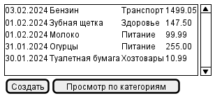
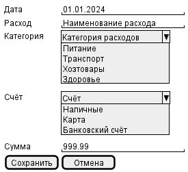

# Система учёта расходов

## Работа с приложением

## Роли приложения

Роли:

- Админ
- Рядовой пользователь

## Функции приложения

Функции админа:

1. Логин к списку всех пользователей
1. Просмотр списка пользователей
1. Ввод данных нового пользователя
1. Просмотр/изменение существующего пользователя
1. Сохранение пользователя
1. Удаление пользователя

Функции рядового пользователя:

1. Логин к списку своих расходов
1. Просмотр списка расходов
1. Ввод данных нового расхода
1. Просмотр/изменение существующего расхода
1. Сохранение расхода
1. Удаление расхода
1. Просмотр расходов за период по категориям

## Экраны приложения

Экраны:

1. Экран логина
1. Список пользователей
1. Карточка пользователя
1. Список расходов
1. Карточка расходов
1. Просмотр расходов за период по категориям

---

### Экран 1 "Логин в приложение"

---

### Экран 2 "Список пользователей"

---

### Экран 3 "Карточка пользователя"

---

### Экран 4 "Список расходов"

---

### Экран 5 "Карточка расхода"

---

### Экран 6 "Список расходов за период"

